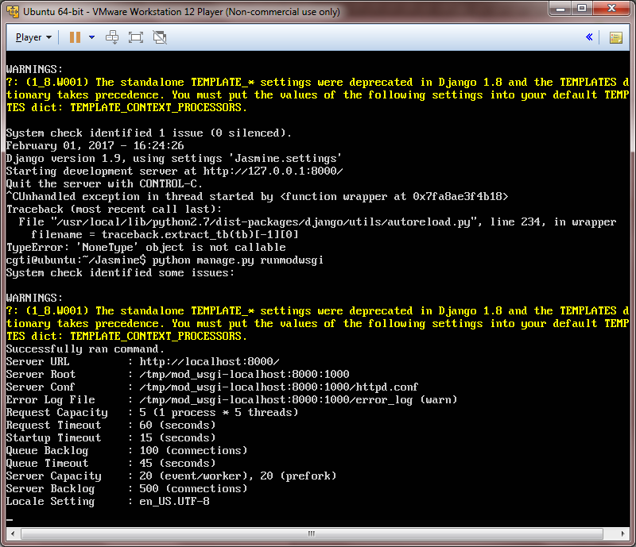
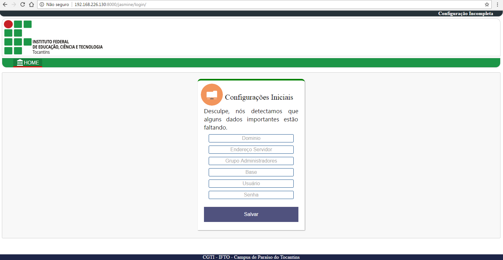
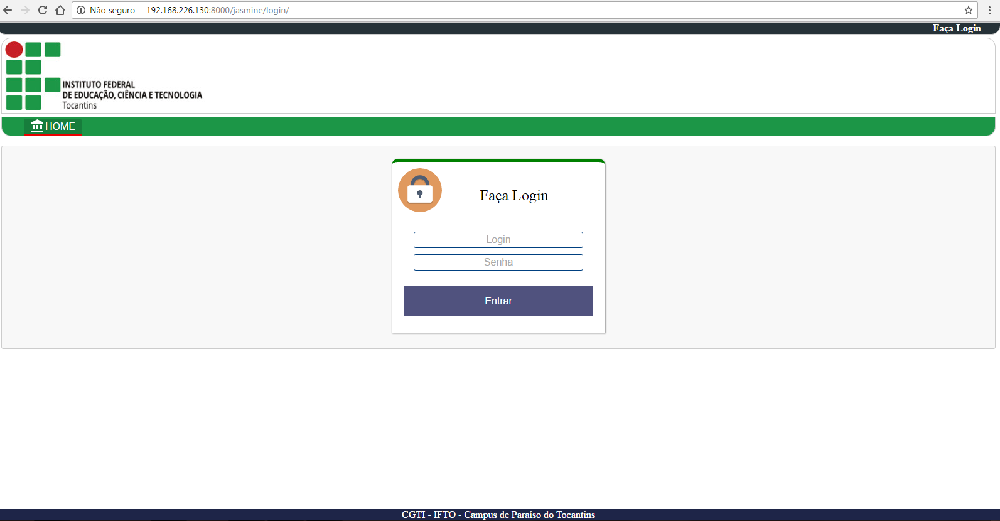
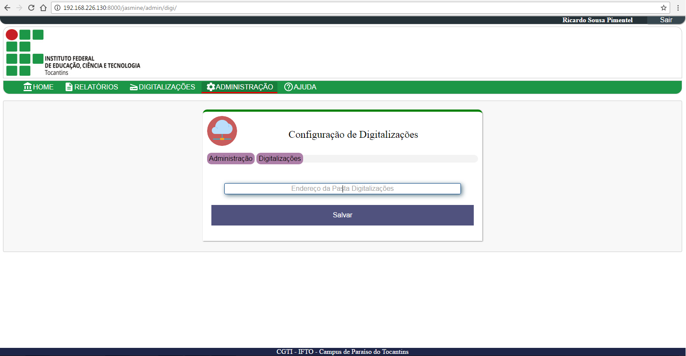

### Resultado Final do Projeto:
[](https://www.youtube.com/watch?v=S1jLF_Dtk18)


### Pré-requisitos

Ter instalado:

-   cups+jasmine ([Parte
    1](https://www.google.com/url?q=http://www.sempreupdate.com.br/2016/10/como-instalar-uma-impressora-em-distribuicoes-baseadas-no-ubuntu-ou-fedora-parte-1.html&sa=D&ust=1486399423267000&usg=AFQjCNHf-brtl0lOLW9o8nLGVicCRdMfMg) e
    [Parte
    2](https://www.google.com/url?q=http://www.sempreupdate.com.br/2016/11/gerando-relatorios-de-impressao-parte-2.html&sa=D&ust=1486399423268000&usg=AFQjCNFD3ISJP-B9D8aV_rYo-XOkGLPCig))
-   mysql-server + phpmyadmin


### Instalação

Substituir arquivo /usr/lib/cups/backend/jasmine pelo arquivo
jasmine dentro de backend cups jasmine.zip

Restaurar banco de dados jasmine pelo arquivo inicial.sql dentro
de inicial.zip

Copiar a pasta do projeto para o servidor (escolher local de
preferência)

Alterar arquivo /Jasmine/Jasmine/settings.py


```
DATABASES = {\
     'default': {\
         'ENGINE': 'django.db.backends.mysql',\
         'NAME': 'jasmine', \#informar nome do banco de dados\
         'USER': 'user', \#informar usuário do banco de dados\
         'PASSWORD': 'password', \#informar senha do banco de dados\
         'HOST': 'localhost',\
         'PORT': '3306'\
         }\
     }
```


#### Instalar python


```
sudo apt-get install python
```


#### Instalar python-pip


```
sudo apt-get install python-pip

```


#### Instalar django 1.9

```
sudo pip install django==1.9
```


#### Instalar mysqlclient-dev


```
sudo apt-get install libmysqlclient-dev

```


#### Instalar mysql-python

```
sudo pip install mysql-python
```


#### Instalar python-ldap


```
sudo apt-get install python-ldap
```


#### Instalar apache2-dev

```
sudo apt-get install apache2-dev
```


#### Instalar mod-wsgi

```
sudo pip install mod-wsgi
```


#### Instalar django-pagination-bootstrap

```
sudo pip install django-pagination-bootstrap
```


#### Instalar django-tinymce-4

```
sudo pip install django-tinymce-4
```


#### Instalar django-tinymce

```
sudo pip install django-tinymce
```


#### Instalar Ghostscript

```
sudo apt-get install ghostscript
```


#### Instalar Tesseract

```
sudo apt-get install tesseract-ocr
```


Adicionar idioma português ao tesseract, copie o arquivo por.traineddata
dentro de por.zip, para /usr/share/tesseract-ocr/tessdata/

#### Instalar pypdfocr

```
sudo pip install pypdfocr
```


Corrigir biblioteca pypdfocr para suportar o idioma português, copie
todos os arquivos dentro de pypdfocr.zip para
/usr/local/lib/python2.7/dist-packages/pypdfocr/, substitua todos os
arquivos.

#### Instalar pdfkit

```
sudo pip install pdfkit
```


####Instalar wkhtmltopdf

```
wget
http://download.gna.org/wkhtmltopdf/0.12/0.12.4/wkhtmltox-0.12.4\_linux-generic-amd64.tar.xz
tar xvJf wkhtmltox-0.12.4\_linux-generic-amd64.tar.xz

sudo cp wkhtmltox/bin/wkhtmlto\* /usr/bin/
```

### Testando configuração inicial

Acessar a pasta raiz do projeto /Jasmine

executar o comando:

```
python manage.py runmodwsgi
```



Acessar pelo navegador o endereço: http://servidor:8000/jasmine




Será apresentada a página de configuração inicial do sistema,

Volte para o servidor execute o comando:

```
sudo python manage.py runmodwsgi --setup-only --port=8000 --user
user --server-root=/etc/mod\_wsgi-express-80
```


Copie o arquivo jasmine dentro de atalho init.d.zip para /etc/init.d/

Altere a permissão do arquivo /etc/init.d/jasmine

```
sudo chmod +x /etc/init.d/jasmine
```

Aplique o atalho na inicialização do sistema

```
sudo update-rc.d jasmine defaults
```

Volte à página de configuração


Preencha os dados solicitados e clique em salvar


### Preparar pastas para digitalização via rede

Criar estrutura das pastas onde serão armazenados os arquivos
digitalizados, uma pasta raiz e pastas internas para cada impressora e
uma pasta para arquivos temporários temp.

Exemplo:

/home/cgti/

Digitalizacoes/

        impressora1/

        impressora2/

        impressora3/

        temp/

Compartilhar as pastas das impressoras.

Faça Login



Acesse o menu Administração


Acesse Conf. de Digitalizações



Especificar o local da pasta raiz dos arquivos digitalizados.


Tutorial criado por Ricardo Pimentel
Analista de Tecnologia da Informação | Campus Paraíso do Tocantins do IFTO
